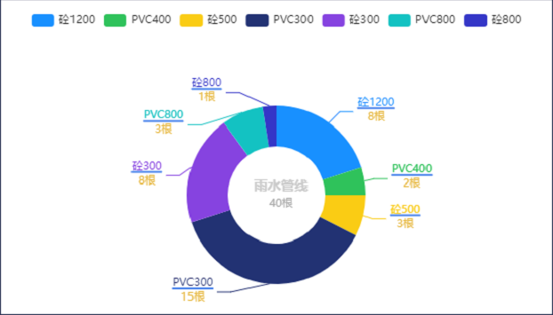

```javascript
    getEchart(data, name, total) {
      var title = [
        {
          text: name,
          subtext: total + '根',
          top: '54%',
          left: '50%',
          textAlign: 'center',
          itemGap: 5,
          subtextStyle: {
            rich: {
              val: {
                fontSize: 24,
                fontWeight: 'bold',
                color: '#E8BA43',
              },
            },
          },
          textStyle: {
            color: '#ccc',
            fontSize: 15,
          },
        },
      ]
      var legend = {
        y: 10,
      }

      var series = [
        {
          type: 'pie',
          radius: ['30%', '55%'],
          center: ['50%', '60%'],
          hoverAnimation: false,
          data: data,
          label: {
            normal: {
              show: true,
              formatter: '{b|{b}}\n{hr|}\n{c|{c}根}',
              rich: {
                a: {
                  fontSize: 14,
                  fontFamily: 'PingFang SC',
                  fontWeight: 400,
                  color: '#fff',
                  textAlign: 'center',
                },
                hr: {
                  borderColor: '#4681ec',
                  width: '100%',
                  borderWidth: 2,
                  height: 0,
                },
                c: {
                  fontSize: 12,
                  fontFamily: 'Source Han Sans CN',
                  color: '#E7B943',
                  fontWeight: 400,
                  lineHeight: 20,

                  align: 'center',
                },
              },
            },
          },
        },
      ]

      return EchartDeploy.deploy(
        title,
        legend,
        false,
        false,
        false,
        false,
        false,
        [
          '#1890FF',
          '#2FC25B',
          '#FACC14',
          '#223273',
          '#8643E0',
          '#13C2C2',
          '#3436C7',
          '#F04864',
        ],
        series,
        []
      )
    }
```

